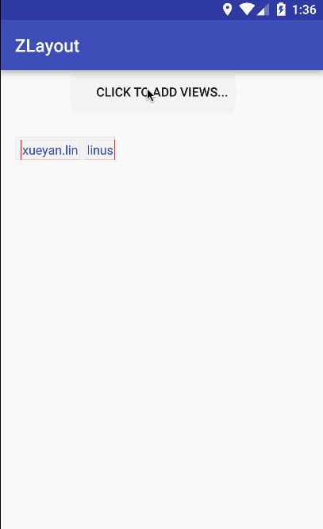
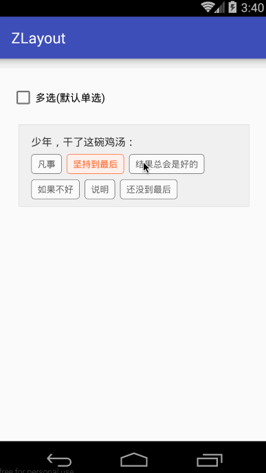

# ZLayout

流式布局，类似自动换行的 LinearLayout，当水平方向不足以放置子 View 时，自动从下一行开始放置。

## 自定义属性

- lineSpacing，行间距；
- maxLines，显示的最大行数；

使用范例：

```
<com.mmlovesyy.zlayout.ZLayout xmlns:z="http://schemas.android.com/apk/res/com.mmlovesyy.zlayout"
            android:id="@+id/z"
            android:layout_width="wrap_content"
            android:layout_height="wrap_content"
            android:background="@drawable/background_zlayout"
            z:lineSpacing="40dp"
            z:maxLines="4" />

```

或者

```
final ZLayout zLayout = new ZLayout(this);
ViewGroup.LayoutParams zLp = new ViewGroup.LayoutParams(ViewGroup.LayoutParams.WRAP_CONTENT, ViewGroup.LayoutParams.WRAP_CONTENT);
zLayout.setMaxLines(2);
zLayout.setLineSpacing(200);
zLayout.setBackgroundDrawable(getResources().getDrawable(R.drawable.background_zlayout));
```


## 注意
如当子 View 是 TextView 时，请务必确保其为文本行数为单行。

## Demo 演示

<br />
<center>

</center>
<br />

<br />
<center>

</center>
<br />

todo list:

- 支持不同高度的子 View；
- 不支持水平方向的 ScrollView，仍然会换行，而非水平滚动；
- 设置高度值无效，效果仍等同于 wrap_content；
